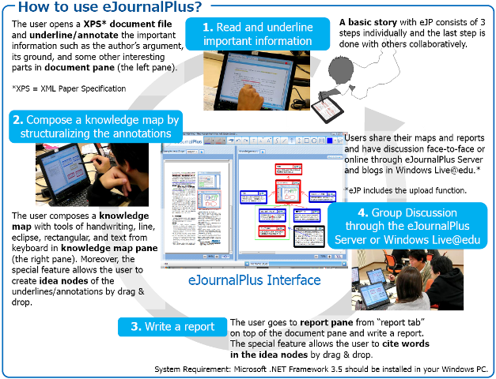

# eJournalPlus
eJournalPlus repository migrated from codeplex

## Product Description

eJournalPlus is a tabletPC based critical reading support software, developed at the Microsoft chair of Educational Environment and Technology(MEET), the University of Tokyo, Japan (more detail about us: http://www.mochi-lab.net/meet/en/about/index.html)

The goal is to assist the user in reading XPS e-documents with accurate comprehension and critical attitude to improve his/her critical reading skills. This software allows the user to underline or mark critical words and phrases in e-documents, to make “knowledge map,” that is similar to argument or conceptual map, based on the passages the user has underlined or marked, and to edit the report with it. Moreover, the special features enable the user to cite the annotated text into the knowledge map directly and likewise, into the report. 

More constructive and critical reading of a text is promoted through dialogue of multiple readers’ comprehension and opinions. Thus, the software collaborates with eJournalPlus Server, which provides administrative functions for e-document distribution, saved file storage, and publication for sharing with others for collaborative commenting. After user authentication, the user can download document files and save or publish assignment files through the server. The eJournalPlus Server also allows the user to exchange push-pin like comments on the concept maps and reports among other users.

*English version (globarized) and eJournalPlus Server has just been published as a stable version!
*日本語によるプロジェクト概要およびソフトウェアのダウンロード
-> http://www.mochi-lab.net/meet/projects/ejournalplus.html

